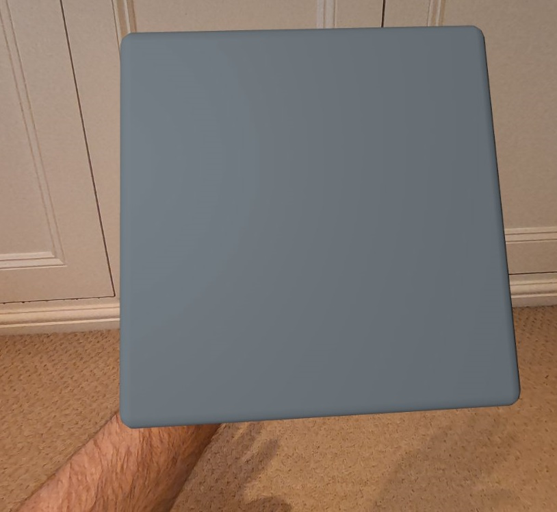
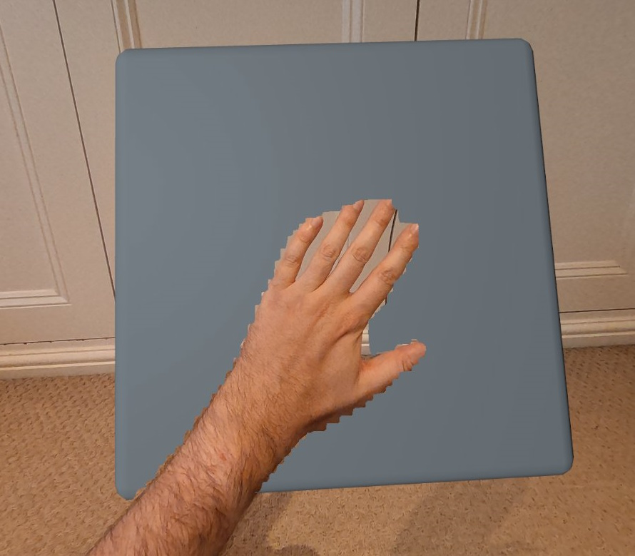

# Occlusion Sample

This sample provides a simple scene with passthrough enabled and a few VR objects to demonstrate the use of Occlusions using the Depth API.

Press the A or X buttons on your controller to cycle through the different occlusion modes:

**Disabled**

When occlusions are disabled, virtual content will always be rendered on top of passthrough.



**Hard Occlusions**

When hard occlusions are enabled you will see that real objects in your environment (e.g. tables, walls, furniture, hands) will occlude the virtual objects rendered by Unreal based on their relative depths.

Hard occlusions provide a simple non-intrusive way to enable occlusions in your app but have a hard jagged edge at the boundary of occluded objects.



**Soft Occlusions**

Soft occlusions improve the quality of the edges by applying a smooth gradient so that the transition is less noticeable. However, more intrusive engine changes were required to support this and so you must use Meta's fork of the engine in order to make use of soft occlusions.


## How to Use

### Load the project

First, ensure you have Git LFS installed by running this command:
```sh
git lfs install
```

Then, clone this repo using the "Code" button above, or this command:
```sh
git clone https://github.com/oculus-samples/Unreal-OcclusionSample
```

### Launch the project in the Unreal Editor using one of the following options.

#### Epic Games Launcher with MetaXR plugin

The easiest way to get started is to use the prebuilt Unreal Engine from the Epic Games Launcher, with MetaXR plugin. **However, if you use this method then only hard occlusions will work. You must use Meta's fork for soft occlusions support.**


1. Install the [Epic Games Launcher](https://www.epicgames.com/store/en-US/download)
2. In the launcher, install UE5 (recommended).
3. Download and install the MetaXR plugin from the [Unreal Engine 5 Integration download page](https://developer.oculus.com/downloads/package/unreal-engine-5-integration).
3. Launch the Unreal Editor
4. From "Recent Projects", click "Browse" and select `OcclusionSample.uproject`

#### Meta fork of Epic’s Unreal Engine

The Meta fork of Epic’s Unreal Engine will give you the most up to date integration of Oculus features. However, you must build the editor from its source.

Follow the instructions on [Accessing Unreal Engine source code on GitHub](https://www.unrealengine.com/en-US/ue-on-github) to obtain:
- an Epic account
- a GitHub account
- authorization to access the Unreal Engine source repository
Disregard instructions on downloading Epic’s Unreal Engine source code as you will be building the Meta fork of Epic’s Unreal Engine source.

Make sure you have Visual Studio installed properly:
- Launch the Visual Studio Installer and click Modify for the Visual Studio version you want to use.
- Under the Workloads tab, click Game development with C++ if it isn’t checked and then click Modify.

1. Download the source code from the [Meta fork of Epic’s Unreal Engine on GitHub](https://github.com/Oculus-VR/UnrealEngine).
2. Follow Epic’s instructions on [Building Unreal Engine from Source](https://docs.unrealengine.com/5.2/en-US/building-unreal-engine-from-source/) to complete the process.

Depending on your machine, the build may take awhile to complete.

# Licenses
The Meta License applies to the SDK and supporting material. The MIT License applies to only certain, clearly marked documents. If an individual file does not indicate which license it is subject to, then the Meta License applies.
